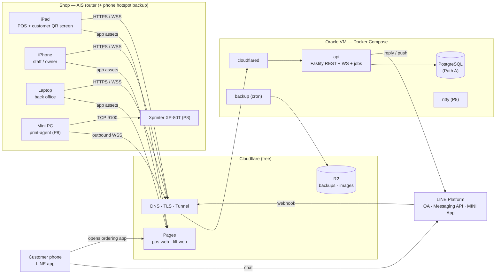
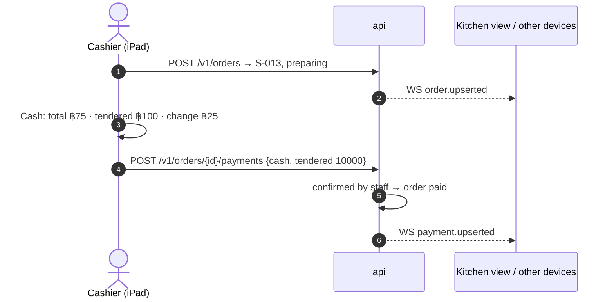
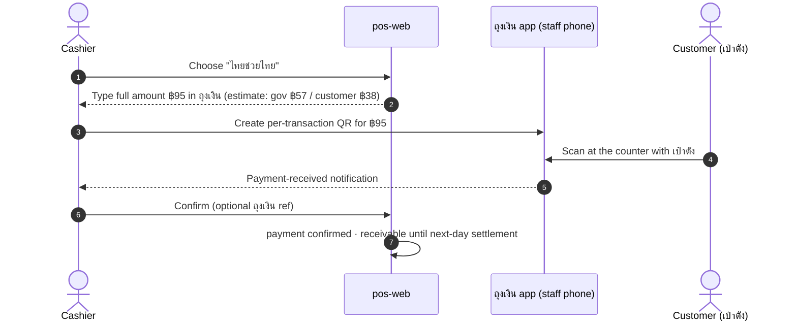

# 02 · Architecture

Technology choices and their status are in [decisions.md](decisions.md). This document describes how the pieces fit together.

## 1. Principles
1. **The cloud is the source of truth.** The Oracle VM holds the only authoritative data. Every device, and the future Mini PC, is a client.
2. **One backend.** A single Fastify service handles REST, WebSocket, the LINE webhook and background jobs. Nothing else to deploy.
3. **Modules with hard edges.** Domain logic (money, orders, payments, tax) is pure TypeScript in `packages/*`, with no I/O. Apps only wire it to HTTP, the database and the UI.
4. **Portable.** Plain Postgres and a Docker Compose stack run unchanged on Oracle, a Mini PC or a VPS.
5. **Free-tier aware.** Reply first on LINE, cache static assets on a CDN, no always-on paid services.
6. **The storefront survives outages.** Walk-in sales keep working offline and sync afterwards.
7. **Money is audited.** Staff confirm every payment by hand, and every change is recorded with who made it and when.

## 2. Deployment view



On Path B (a 1 GB Micro VM), `db` moves to managed Postgres (Supabase free) and nothing else changes.

**Current setup (D-10, interim, no domain):** `edge`/`cloudflared` are replaced by **Caddy on the VM** (Let's Encrypt, free sslip.io hostname, ports 80/443 open). Cloudflare Pages still hosts the web apps. The diagram shows the target design for once a domain is bought. See [05-infrastructure.md](05-infrastructure.md).

## 3. Components and repository layout

```
/
├─ CLAUDE.md                 project guide for Claude (read first)
├─ apps/
│  ├─ api/                   Fastify: REST /v1, WebSocket, LINE webhook, jobs (pg-boss)
│  │  └─ src/modules/        auth · menu · orders · payments · customers · reports ·
│  │                         expenses · settings · line · sync · print (P8)
│  ├─ pos-web/               staff PWA: POS · order board · kitchen · menu · payments ·
│  │                         customers · back office · settings (role-gated)
│  ├─ liff-web/              customer app in LINE: menu · cart · checkout · pay · status
│  ├─ print-agent/           (P8) Mini PC service → XP-80T
│  ├─ pos-mobile/            (P10) Capacitor shell: pos-web as an iPad/iPhone app
│  └─ pos-desktop/           (P10) Electron shell: pos-web for Windows/macOS/Linux
├─ packages/
│  ├─ shared/                domain core: types, zod schemas, enums, order/payment
│  │                         state machines, money & business-date utils (no I/O)
│  ├─ db/                    Drizzle schema, migrations, seed, report queries
│  ├─ promptpay/             EMVCo PromptPay payload + CRC16 + QR helpers (pure)
│  ├─ line/                  LINE wrapper: signature check, Flex builders,
│  │                         quota-aware sender, rich-menu definitions
│  ├─ finance/               reports, P&L, Thai tax estimators; tax rules as data per year
│  ├─ ui/                    design tokens + React components shared by both web apps
│  ├─ i18n/                  th/en catalogs, ฿ and BE/CE date formatters
│  ├─ notify/                (P8) ntfy / web-push adapters
│  ├─ escpos/                (P8) ticket layout → raster → ESC/POS bytes
│  └─ config/                shared tsconfig and Biome presets
├─ design/                   brand, wireframes, Figma links, rich-menu art, UX notes
├─ infra/
│  ├─ compose/               docker-compose.yml, .env.example, overrides per environment
│  ├─ cloudflare/            tunnel config, Pages/R2 notes
│  ├─ oracle/                VM bootstrap (cloud-init), hardening, firewall
│  ├─ backup/                dump/restore scripts, restore-drill checklist
│  └─ monitoring/            uptime checks, alert routing
├─ docs/                     requirements … roadmap, decisions, PROGRESS, checkpoints/
├─ scripts/                  dev helpers (seed, reset, test QR generator)
├─ .claude/agents/           project subagents
├─ .claude/skills/           project skills (/checkpoint)
└─ .github/workflows/        CI (lint, typecheck, test, build) and deploy
```

**How this maps to the folders suggested in the brief:**

| Suggested | Here |
|---|---|
| `packages/shared` | `packages/shared` |
| `apps/backend` | `apps/api` |
| `apps/pos-web` | `apps/pos-web` |
| `ux/ui` | `design/` (design work) + `packages/ui` (component code) |
| `line` | `packages/line` (SDK wrapper) + `apps/api/src/modules/line` (webhook) + `apps/liff-web` (customer app) |

**Components the brief did not list:**
- `packages/db`, `packages/promptpay`, `packages/finance`, `packages/i18n`
- `apps/liff-web`: the customer app, which is separate from the LINE plumbing
- `infra/`: deployment, backups, monitoring
- CI/CD
- `docs/checkpoints`
- the P8 pair `apps/print-agent` + `packages/escpos`
- the background job runner (a module inside `api`)

### Dependency rules (enforced in P1 by lint and tsconfig references)
- An app may import packages. **An app never imports another app.**
- `shared`, `promptpay` and `finance` are **pure**: no network, database, DOM or env access, so they are 100% unit-testable.
- Only `packages/db` imports the ORM. Only `packages/line` and `api/modules/line` talk to LINE.
- `ui` depends on `i18n` and `shared` types only. Business rules never live in React components.
- Money and totals are computed only in `shared`/`finance` and run on the server. The UI only formats them.

## 4. Key flows

### 4.1 LINE order paid by PromptPay
```mermaid
sequenceDiagram
  autonumber
  actor C as Customer (LINE)
  participant App as liff-web
  participant API as api
  participant L as LINE Platform
  participant POS as Staff devices
  C->>App: Tap "สั่งอาหาร" in rich menu
  App->>API: Exchange LINE ID token → session; GET /v1/menu
  C->>App: Cart · pickup/room · PromptPay
  App->>API: POST /v1/orders (Idempotency-Key)
  API-->>POS: WS order.upserted (L-012, new, unpaid) + alert sound
  API-->>App: order L-012, total ฿95, QR payload
  App->>L: liff.sendMessages("ยืนยันออเดอร์ #L-012")
  L->>API: webhook text + replyToken
  API->>L: reply (free): Flex summary + QR image (exact ฿95)
  C->>C: Save QR → bank app → scan from gallery → pay
  C->>L: Slip image / tap "โอนแล้ว"
  L->>API: webhook image / postback
  API-->>POS: payment → awaiting confirmation
  API->>L: reply (free): "ได้รับแล้ว รอร้านตรวจสอบ"
  POS->>API: Staff sees ฿95 in bank app → Confirm
  API-->>POS: WS payment.upserted (confirmed)
  API-->>App: status page updates live
  POS->>API: Mark ready
  API->>L: push (1 message of quota): "อาหารพร้อมแล้ว"
```
If `sendMessages` is unavailable (the app was opened outside the OA chat), the app shows the QR itself. It sends a push only if the quota policy allows.

### 4.2 Storefront order paid in cash


### 4.3 Government co-pay at the storefront

A LINE customer who picked this method sees "ชำระที่หน้าร้านด้วยเป๋าตัง" and follows the same steps at pickup.

### 4.4 Changing the payment method
The pending payment is cancelled and a new pending payment is created for the new method, both in one transaction. The API emits `payment.upserted` twice and then sends the matching reply: a QR for PromptPay, pay-at-pickup for cash, pay-at-storefront for gov co-pay. Once a payment is confirmed, the method can only change through a manager void.

## 5. Realtime sync protocol
- **Write path:** client → REST → service → DB transaction → the synced row's `rev` = `nextval('rev_seq')` → commit → in-process event bus → WebSocket fan-out.
- **Events:** `order.upserted`, `payment.upserted`, `menu.upserted`, `settings.updated`, `customer.upserted`, and `alert.new_order` (plays a sound). Each event carries `{id, rev, data}`.
- **Audiences:** staff devices get every event their role allows. A customer's session gets only its own orders. The print agent gets `print_job.*` (P8).
- **Client state:** a store keyed by id. Apply an event only if `event.rev` is greater than the stored `rev`. Track the highest `rev` seen as `lastRev`.
- **Reconnect:** exponential backoff. On reconnect, call `GET /v1/sync?since=lastRev` (paged) before replaying live events. A ping/pong heartbeat every 25 s.
- **Conflicts:** `PATCH` sends `expectedVersion`. A mismatch returns 409; the client reloads the entity and tells the user what changed.
- **Duplicates:** `POST` sends an `Idempotency-Key`. The server stores `client_request_id` as unique, so a retry returns the original result.

## 6. API surface (v1, summary)
| Area | Endpoints |
|---|---|
| Auth | `POST /v1/auth/device` (owner registers device) · `POST /v1/auth/pin` · `POST /v1/auth/owner` (password + TOTP) · `POST /v1/auth/step-up` · `GET /v1/auth/staff` (tiles for the PIN screen, device token) · `POST /v1/auth/invite/preview` · `POST /v1/auth/invite/accept` (public, token from the invite link) · `GET /v1/auth/me` · `POST /v1/auth/logout` · `POST /v1/auth/line` (LINE ID token → customer session) |
| Menu | `GET /v1/menu?channel=` (public, no session: available items with the channel price, groups and options; never a cost) · staff lists `GET /v1/menu/{categories,items,modifier-groups}` (`menu.availability`, every role) · CRUD (`menu.edit`: managers, owner) on `/v1/menu/{categories,items,modifier-groups}` and options at `/v1/menu/modifier-groups/{id}/options`, `/v1/menu/modifier-options/{id}`; `DELETE` archives (past orders keep their snapshots); photos are an https URL · `PATCH /v1/menu/items/{id}/availability` and `/v1/menu/modifier-options/{id}/availability` (`menu.availability`: the kitchen's "หมด" toggle; `expectedVersion` optional there) |
| Orders | `POST /v1/orders` · `GET /v1/orders?day=&status=&channel=` · `GET/PATCH /v1/orders/{id}` · `POST /v1/orders/{id}/transition` · `POST /v1/orders/{id}/cancel` |
| Payments | `POST /v1/orders/{id}/payments` · `POST /v1/payments/{id}/{claim,confirm,change-method,void,refund}` · `GET /v1/payments/{id}/qr.png` (signed, short-lived) |
| Customers | `GET /v1/customers` · `GET /v1/customers/{id}` · `POST /v1/customers/{id}/anonymize` |
| Reports | `GET /v1/reports/{summary,items,heatmap,customers,pnl}?from=&to=&granularity=` · `GET /v1/reports/tax?year=` · `GET /v1/exports/{kind}` |
| Expenses | CRUD `/v1/expenses` |
| Settings | `GET/PATCH /v1/settings/{shop,opening-hours,numbering,payments,promptpay,gov-copay}` (`line` comes with P4). Read: `settings.view` (not the kitchen). Write: `settings.edit` (manager, owner); PromptPay ID and the co-pay scheme: owner + step-up + audit + alert (`settings.promptpay`, `settings.gov_copay`). `numbering` is the business-day cutoff the order numbers reset at. A PATCH carries `expectedVersion` (0 = never saved; GET then returns the default) · `/v1/staff`, `/v1/devices` (list, create staff, revoke, PIN) · `GET/POST /v1/staff/invites`, `POST /v1/staff/invites/:id/revoke`, `POST /v1/staff/:id/role` (owner + step-up + audit + alert, D-23) |
| Sync | `GET /v1/sync?since=` · `WS /v1/ws` |
| LINE | `POST /line/webhook` (signature-verified, raw body) |
| Ops | `GET /healthz` · `GET /readyz` · (P8) `WS /v1/agents/print` |

Errors use one JSON shape: `{code, message, details}`, with Thai and English messages chosen by the client locale.

## 7. Security architecture
- **Transport:** HTTPS/WSS only, terminated at Cloudflare. The VM exposes no public HTTP ports; SSH is key-only and restricted (see infra doc). CORS allows only our own domains. The web apps set a strict CSP.
- **Identities:**
  - devices: owner-registered, revocable token;
  - staff: PIN, giving a session bound to the device (every request carries the device token; 12 h, idle 2 h);
  - owner: password + TOTP (or a one-time recovery code), with step-up re-auth that lasts 5 minutes; owner sessions last 8 h, idle 30 min;
  - customers: LINE ID token checked with LINE's verify endpoint, giving a customer session;
  - print agent: its own device token.
- **Roles:** owner > manager > cashier > kitchen. The permission matrix lives in `packages/shared`, and the API checks it on every route.
- **Sensitive actions:** changing the PromptPay ID, voids and refunds after confirmation, staff or device changes, and exports all require step-up auth, are written to `audit_log`, and alert the owner.
- **LINE webhook:** the HMAC-SHA256 signature is checked over the raw body. `webhookEventId` removes duplicates, because redelivery is on.
- **Abuse limits:** PIN attempts (5 wrong tries lock the account for 5 minutes, then 1 hour, then 24 hours; reset by a good sign-in; the owner password sign-in locks for 15 minutes and the lock is never revealed to the caller, who sees the same 401 as for an unknown e-mail); rate buckets on the owner sign-in and step-up routes; customer orders (rate limit, and at most 3 unpaid open orders per customer); webhook body size.
- **Data:**
  - Postgres is reachable only on the private Docker network, with a least-privilege app user;
  - backups are encrypted before upload;
  - slip images sit in a private bucket behind signed URLs and are deleted after 90 days (configurable);
  - secrets live in a `chmod 600` `.env` on the VM and in GitHub Actions secrets, never in git.

## 8. Offline strategy (storefront)
- **Works offline:**
  - creating orders;
  - showing the PromptPay QR (`packages/promptpay` is pure and runs in the browser; the PromptPay ID is cached from settings);
  - confirming cash or PromptPay payments.

  Each action is queued in an IndexedDB outbox with its idempotency key.
- **Offline order numbers** come from a device-scoped sequence (e.g. `X1-07`) and keep that number after syncing, so the kitchen and customer never see it change.
- **When the connection returns,** the outbox replays in order. Menu and settings: the server wins. Orders are append-only, so they don't conflict. Payment confirmation is idempotent per payment id.
- **Not offline:** LINE orders (they live in the cloud; see them on a phone with mobile data), reports and settings.
- **Operational fallback:** keep one staff phone on mobile data, and a hotspot if the AIS line drops.

## 9. Load and capacity (estimate)
- 50–150 orders a day, peaking around 30 an hour.
- At most 6 staff devices and about 30 customer sessions at once.
- At most about 1,000 LINE webhook events a day.
- The database grows roughly 100–200 MB a year, including indexes. Slip and photo images live in R2.

That is tiny. One small VM has headroom many times over, so the limits we face are **operational** (backups, updates, quotas), not scale.

## 10. Failure modes
| Failure | Effect | Mitigation |
|---|---|---|
| Shop internet down | iPad offline | Offline outbox; phone hotspot; LINE orders still land in the cloud, visible on a phone with mobile data |
| API container crash | Online features down | Docker `restart: unless-stopped`, health check, uptime alert |
| VM lost / Oracle account problem | Full outage | Encrypted off-site backups + Compose and scripts → restore on another Docker host (Mini PC via Tunnel, or a VPS) in ≤ 2 h |
| Database damage | Data loss | Hourly dumps; monthly restore drill |
| LINE webhook errors | Missed events | Webhook redelivery on; idempotent handling; LINE console error statistics |
| LINE quota used up | No push messages | Reply first; policy switches to `off`; customers use the live status page |
| Lost or stolen iPad | Unauthorised access | Revoke the device token; auto-lock with PIN; only cached data on the device |
| PromptPay ID tampered with | Money goes to the wrong account | Owner-only change with step-up, audit and alert. Staff SOP: the bank app shows the shop's account name — check it |

## 11. Trade-offs and what to revisit as the shop grows
| Choice now | Trade-off | Revisit when |
|---|---|---|
| One VM | Simple, but a single point of failure | Downtime costs sales → warm standby on the Mini PC, or managed Postgres |
| Events and jobs inside the API process | Nothing extra to run | More than one API instance → Postgres LISTEN/NOTIFY, `apps/worker` |
| Manual payment confirmation | Free, but uses staff attention | Volume grows → bank merchant QR with API/webhook (fees) |
| LINE free plan | ฿0, but 300 pushes a month | LINE orders over about 250 a month → Basic plan |
| Item-level cost estimates | Quick to set up, approximate | Margins matter → recipe/ingredient costing (P7) |
| Self-hosted Postgres (Path A) | Full control, owner does ops | Ops becomes a burden → managed Postgres |
| Web app in Safari/browsers | Nothing to install, instant updates, ฿0 | Alarms, printing or storage limits hurt → native apps (P10, §12) |

## 12. Client platforms and the native path
Decision: [D-19](decisions.md#d-19--client-platforms-and-the-native-path--proposed-depends-on-q13).

### 12.1 Web first: Safari on iPad/iPhone, browsers on computers
| | Safari tab | Added to Home Screen (still Safari) |
|---|---|---|
| Full screen, no browser bars | No | Yes |
| Web Push notifications (iOS/iPadOS 16.4+) | No | Yes ✅ [WebKit](https://webkit.org/blog/13878/web-push-for-web-apps-on-ios-and-ipados/) |
| Stored data (device token, offline outbox) | **Deleted after 7 days without use** ✅ [WebKit](https://webkit.org/tracking-prevention/) | Exempt from the 7-day deletion |
| Background tab | Suspended; WebSocket drops. Catch-up sync (§5) restores state when it comes back | Same when the app is in the background |
| Sound alerts | Only after a tap unlocks audio | Same |
| Direct printing to the XP-80T | Not possible (no raw TCP/USB/Bluetooth) | Not possible. Use the print agent (P8) |

- **Recommendation:** add `pos-web` to the Home Screen on every staff iPad and iPhone.
- **If a device does lose its token** (Safari tab unused for 7 days), re-registering must take seconds: the owner shows a pairing code or QR on another logged-in device.
- **Testing:** Playwright runs Chromium, Firefox **and WebKit**. Real iPad and iPhone checks in Safari are still required for each phase, because Playwright's WebKit is not Safari on iOS.

### 12.2 Seams built now (P1/P3), so native later is additive
1. **API base URL from config** (`VITE_API_URL`). The app never assumes it is served from the API's origin.
2. **Bearer tokens** for devices, staff and customers (D-17). Native apps run on origins such as `capacitor://localhost` or `app://`, where cookies are unreliable.
3. **Configurable CORS allow-list** (env), so native origins can be added in P10 without code changes.
4. **Platform interface** in `apps/pos-web/src/platform/`: `sound`, `notify`, `wakeLock`, `tokenStore`, `print`. In P3 it has **web implementations only** (`print` reports "use the print agent"). Features call the interface, never browser APIs directly.

Nothing else native is built before P10.

### 12.3 Native shells (P10)
| | iPad / iPhone — `apps/pos-mobile` | Windows / macOS / Linux — `apps/pos-desktop` |
|---|---|---|
| Shell | Capacitor, bundling the `pos-web` build | Electron, bundling the `pos-web` build |
| Adds | APNs push with custom sound; keep-awake; Keychain token storage; direct LAN printing (TCP 9100) via community plugins | Installer and auto-update; tray; start at login; direct LAN/USB printing using `packages/escpos` in the main process |
| Platform interface | Capacitor plugin implementations | Electron IPC implementations |
| Build machine | **macOS + Xcode** (a Mac or cloud macOS CI) | Windows/Linux runners; macOS for the Mac build |
| Distribution | Apple Developer Program (US$99/yr): TestFlight internal testing first, Unlisted App Store later | Microsoft Store (free registration) or a direct installer; AppImage/.deb on Linux; Developer ID + notarization on macOS (same Apple membership) |
| Updates | App/TestFlight updates. Loading the UI from `pos.<domain>` would give instant updates, but check Apple guideline 4.2 if publishing publicly | electron-updater through GitHub Releases, or Store updates |

The backend does not change for native apps. They use the same REST, WebSocket and sync protocol, and are registered as devices like any browser.
