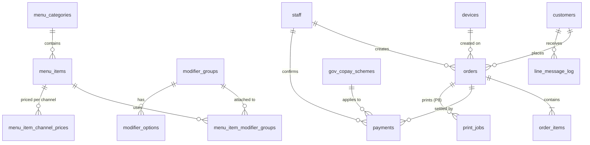
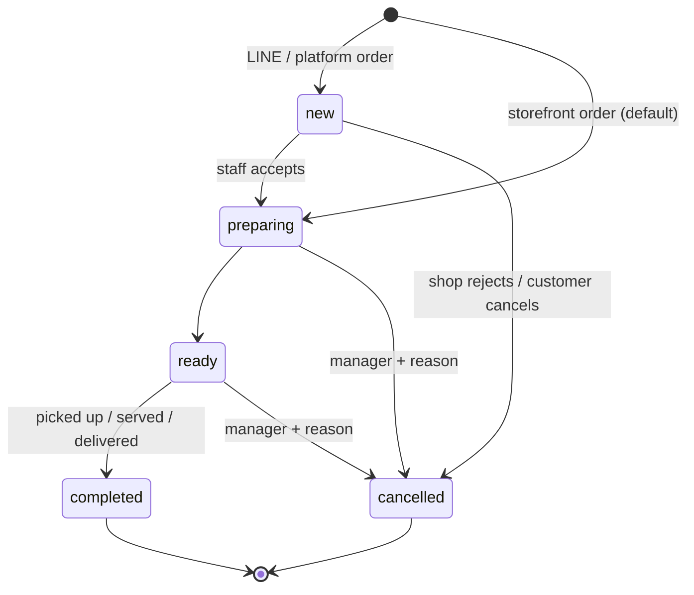
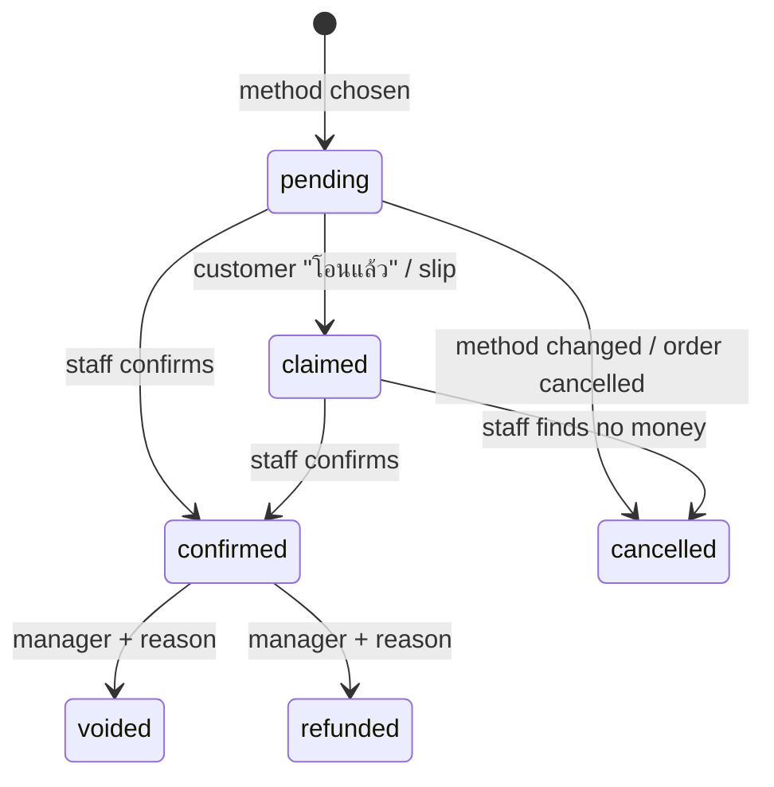

# 03 · Data Model

PostgreSQL and Drizzle (see [D-03](decisions.md#d-03--database--open-q1)). This is the logical design. The Drizzle schema in `packages/db` (P1) is the source of truth once it exists; keep this file in step with it.

## 1. Conventions
- **IDs:** UUIDv7 (`uuid`), which sort by time, from the portable `uuid_generate_v7()` SQL function (native `uuidv7()` needs PostgreSQL 18). People see `order_no`, never the UUID.
- **Money:** `bigint` in satang, with the suffix `_satang`. THB only. Round half up to 1 satang only in `packages/shared`.
- **Time:** `timestamptz` (UTC). `business_date date` = local date in Asia/Bangkok minus the cutoff (default 04:00).
- **Sync columns** on every table that is synced to clients:
  - `version int`: increments on each update, used for optimistic locking;
  - `rev bigint`: the global `rev_seq`, set by a trigger on insert and update;
  - `updated_at`.

  A `BEFORE INSERT OR UPDATE` trigger sets all three, so no code path can forget them (as built in P1).
- **Soft delete:** menu data uses `archived_at`. Financial rows are never deleted; they are voided or refunded. Triggers reject `DELETE` on `orders`, `order_items`, `payments` and `expenses`, and any change to `audit_log` (append-only).
- **Snapshots:** an order item copies the name, price, cost and modifiers at the time of sale, so later menu edits never change history.
- **Single shop:** there is no `shop_id`. Adding branches later means adding it (listed in the architecture doc's revisit table).

## 2. Entity relationships

## 3. Tables

### Menu
| Table | Key columns |
|---|---|
| `menu_categories` | `id, name_th, name_en, sort, active, version, rev` |
| `menu_items` | `id, category_id, name_th, name_en, description_th, description_en, price_satang, est_cost_satang, image_key, is_available, channels text[]` (`storefront, line, grab, lineman`)`, sort, archived_at, version, rev` |
| `menu_item_channel_prices` | `item_id, channel, price_satang` (overrides for Grab / LINE MAN) |
| `modifier_groups` | `id, name_th, name_en, min_select, max_select, sort` (e.g. เส้น, ความเผ็ด, เพิ่มพิเศษ) |
| `modifier_options` | `id, group_id, name_th, name_en, price_delta_satang, cost_delta_satang, is_available, sort` |
| `menu_item_modifier_groups` | `item_id, group_id, sort` |

### Orders
| Table | Key columns |
|---|---|
| `orders` | `id, order_no, business_date, channel` (`storefront, line, grab, lineman, phone`)`, fulfillment` (`dine_in, takeaway, pickup, room_delivery, platform_delivery`)`, room_no, customer_id?, status, payment_status, subtotal_satang, discount_satang, discount_reason, total_satang, platform_order_ref, platform_commission_satang, note, created_by_staff_id?, created_on_device_id?, client_request_id (unique), placed_at, accepted_at, ready_at, completed_at, cancelled_at, cancel_reason, version, rev` |
| `order_items` | `id, order_id, menu_item_id, name_th_snapshot, name_en_snapshot, unit_price_satang, unit_cost_satang, qty, modifiers jsonb` (each: group, option, name, price delta, cost delta)`, note, line_total_satang` |
| `daily_counters` | `business_date (pk), last_seq`, incremented with `UPDATE … RETURNING` inside the order transaction |

### Payments
| Table | Key columns |
|---|---|
| `payments` | `id, order_id, method` (`cash, promptpay, gov_copay, platform, other`)`, status` (`pending, claimed, confirmed, cancelled, voided, refunded`)`, amount_satang, tendered_satang?, change_satang?, promptpay_target_masked?, qr_payload?, scheme_id?, est_gov_share_satang?, est_customer_share_satang?, slip_image_key?, slip_ref?` (P9 duplicate-slip check)`, reference_note, claimed_at, confirmed_by_staff_id?, confirmed_at, void_reason, client_request_id` (unique, idempotent POST)`, version, rev`. A check requires `confirmed_by_staff_id` and `confirmed_at` once confirmed |
| `gov_copay_schemes` | `id, code, name_th, name_en, gov_share_bp` (6000 = 60%)`, gov_daily_cap_satang, gov_total_cap_satang?, active_from, active_to, active_from_minute, active_to_minute` (minutes from local midnight, e.g. 360–1380 = `06:00–23:00`)`, channels text[]` (default `{storefront}`)`, settlement_note, enabled` |

### People and devices
| Table | Key columns |
|---|---|
| `customers` | `id, line_user_id (unique, nullable), display_name, picture_url, nickname, phone?, room_no?, note, first_seen_at, last_order_at, order_count, total_spent_satang, privacy_ack_at, marketing_consent_at?, unfollowed_at?, anonymized_at?, version, rev` |
| `staff` | `id, display_name, role` (`owner, manager, cashier, kitchen`)`, pin_hash, active, failed_pin_count, locked_until` |
| `owner_credentials` | `staff_id, email, password_hash, totp_secret_enc` |
| `devices` | `id, name, kind` (`ipad, iphone, laptop, print_agent, display`)`, token_hash, last_seen_at, revoked_at` |

### Money outside orders
| Table | Key columns |
|---|---|
| `expenses` | `id, business_date, category` (`ingredients, packaging, gas, utilities, rent, staff, platform_fees, equipment, other`)`, amount_satang, vendor, note, receipt_image_key, created_by_staff_id` |
| `tax_profiles` | `year, filer_type` (`individual`)`, allowances jsonb` (owner-entered), `method_preference` |

Tax **rules**, meaning brackets, flat-rate %, thresholds and allowance caps, are not a table. They are versioned data files in `packages/finance/rules/th-pit-<year>.ts`, reviewed every year.

### Settings, integration and audit
| Table | Key columns |
|---|---|
| `settings` | `key (pk), value jsonb, version, updated_by, updated_at`. Keys: `shop`, `promptpay` (`id_type, id_value`), `payment_methods`, `numbering`, `business_day`, `opening_hours` (A3), `line_policy`, `retention` |
| `line_events` | `webhook_event_id (unique), type, user_id, payload jsonb, received_at, processed_at, error`. Kept 30 days |
| `line_message_log` | `id, customer_id, kind` (`reply, push`)`, template, order_id?, counted boolean, sent_at`, used by the quota tracker |
| `audit_log` | `id, at, actor_type` (`staff, customer, system`)`, actor_id, device_id, action, entity, entity_id, before jsonb, after jsonb, ip` |
| `print_jobs` (P8) | `id, order_id, kind` (`kitchen, receipt`)`, status` (`queued, sent, failed`)`, attempts, last_error, requested_by, created_at, sent_at` |

### Main indexes
`orders(business_date)`, `orders(status) where status in ('new','preparing','ready')`, `orders(customer_id)`, `order_items(order_id)`, `payments(order_id)`, `payments(status) where status in ('pending','claimed')`, `customers(line_user_id)`, and `(rev)` on every synced table.

## 4. State machines

### Order status (fulfilment)

### Payment record

### Order `payment_status` (derived, stored for fast queries)
- `unpaid`: no confirmed payment and nothing claimed.
- `awaiting_confirmation`: at least one payment is `claimed`.
- `partially_paid`: confirmed total is below the order total.
- `paid`: confirmed total is at least the order total.
- `refunded`: every confirmed payment was refunded.

**Rules**
- Only staff can move a payment to `confirmed`, and only for its exact amount.
- For cash, `tendered ≥ amount` and `change = tendered − amount`.
- Changing the method = cancel the pending payment and create a new one (§4.4 of the architecture doc).
- An unpaid LINE order goes *overdue* after N minutes (setting, default 20). Staff are reminded and decide. Automatic cancellation is off by default.
- Whether the kitchen may start an unpaid order depends on the method. By default: PromptPay orders wait for a claim, and cash or gov co-pay pickup orders start once accepted.

## 5. Order numbers
- Display format: channel letter + daily sequence: `S-013` (storefront), `L-014` (LINE), `G-015` (Grab), `M-016` (LINE MAN), `P-017` (phone). One sequence for all channels, so "number 14" is never ambiguous.
- The sequence resets at the business-day cutoff.
- Offline storefront orders use `X<device>-<seq>` and keep it after syncing.

## 6. Reporting
- Reports are computed on the fly from `orders`, `order_items`, `payments` and `expenses`, grouped by `business_date`. At this data size that is fast.
- Materialised daily rollups come later, only if a query exceeds about 300 ms.
- Revenue is recognised on the order's business date, for **paid** orders only.
- Gov co-pay money counts as revenue on the sale date and as a receivable until it is settled the next day.
- Platform orders count the platform price as revenue and the commission as an expense.
- Cost of goods = Σ(`unit_cost_satang × qty`) from item snapshots, until P7 adds recipes.

## 7. Retention (defaults, all configurable; confirm legal periods in [06-legal-compliance.md](06-legal-compliance.md))
| Data | Keep |
|---|---|
| Orders, payments, expenses, audit log | ≥ 5 years (tax records; ⚠️ confirm) |
| Slip images | 90 days after confirmation |
| `line_events` | 30 days |
| Inactive customer personal data | Anonymised after 24 months without an order. Order rows keep the anonymised `customer_id` |
