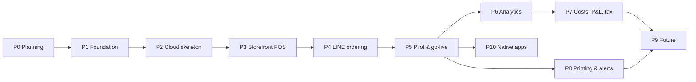

# 09 · Roadmap

Each phase has a checkpoint file in [checkpoints/](checkpoints/). A phase is **done** only when its exit criteria are met and recorded there, and `docs/PROGRESS.md` points to the next phase.

**MVP go-live = P1 → P5.** Analytics, P&L and tax (P6–P7) come after go-live. The data model captures everything they need from the first order, so nothing is lost by waiting.

| Phase | Goal | Main exit criteria | Size |
|---|---|---|---|
| **P0 Planning** | Agree scope, architecture and decisions | Open questions answered; decisions Accepted/Proposed; roadmap agreed | S |
| **P1 Foundation** | Monorepo, tooling, domain core, DB schema, PromptPay library, design tokens | CI green; state-machine and money tests; PromptPay verified in 1 bank app (more later); schema migrates from zero | M |
| **P2 Cloud skeleton** | The 24/7 platform, before features | Oracle VM + Caddy HTTPS (free hostname) live; `/healthz` monitored; backup + **restore drill** passed; deploy on merge | M |
| **P3 Storefront POS** | Sell at the counter | Device + PIN auth; menu CRUD with modifiers; order entry; order board/kitchen view; cash change calculator; PromptPay QR screen; gov co-pay flow; method change; void; realtime < 1 s across 2 devices; offline outbox; daily summary | L |
| **P4 LINE ordering** | Order and pay through LINE | OA + channels; webhook (signature, idempotent); rich menu; customer app; reply-first messages with the QR image; slip / "โอนแล้ว"; status page; quota tracker; privacy notice | L |
| **P5 Pilot & go-live** | Run the real shop on it | Real-device UAT (iPad, iPhone, LINE on iOS and Android); SOPs and training; security/PDPA review; 1–2 weeks of soft launch; go-live checklist | M |
| **P6 Analytics** | Understand the business | Day/month/year dashboards with comparisons; top items; menu-engineering matrix; heatmap; customer segments; exports | M |
| **P7 Costs, P&L & tax** | Know the profit and tax | Item costs; expense ledger; platform fees; P&L; tax estimator (flat vs actual, 0.5% method); ภ.ง.ด.94; VAT and e-Payment watches; cash receipts–payments report; tested against the accountant's figures | M |
| **P8 Printing & alerts** | Kitchen tickets and phone alarms | Self-hosted ntfy (thumbnail, priority); print agent on the Mini PC; XP-80T raster Thai tickets; retries; reprint | M |
| **P9 Future** | Grow when needed | Chosen from the backlog in the P9 checkpoint | — |
| **P10 Native apps** | Installable apps from the same code: desktop (Windows/macOS/Linux) first, then iPad/iPhone | Desktop app installs, updates itself and prints directly; iOS app on TestFlight with push alarm and LAN printing; the same E2E suite passes in every shell | M–L |

P10 can run alongside P6–P8. It depends on Q13: the Apple fee and Mac access decide whether the iOS part can start.

Size: S ≈ days, M ≈ 1–2 weeks, L ≈ 2–4 weeks for one developer working with Claude Code (rough; revise at each checkpoint).

## Principles for every phase
1. **Plan the phase first.** Read the phase checkpoint, **ask the owner for any missing information the phase needs** (recorded in [10-open-questions.md](10-open-questions.md)), refine the task list with the owner, and record any decision in [decisions.md](decisions.md).
2. **Build in vertical slices.** Each slice is visible on a real device as early as possible.
3. **Test money logic first.** Nothing touching amounts, payments or tax merges without tests.
4. **Keep diffs surgical.** Change only what the task needs.
5. **Close with `/checkpoint`.** Update the progress log and the as-built notes.
